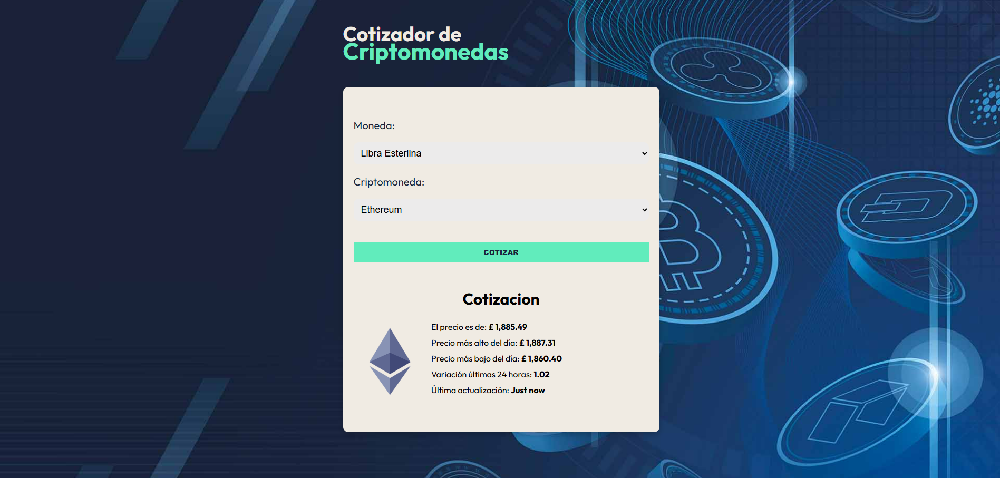

# 💰 Búsqueda y Visualización de Criptomonedas

Una aplicación web que permite buscar y visualizar información sobre diversas criptomonedas. La aplicación proporciona una interfaz limpia e intuitiva para ver datos en tiempo real sobre criptomonedas seleccionadas.

🔗 [Live Demo](https://crypto-search-display.netlify.app/)

---

## 📊 Vista Previa


---

## 📚 Tecnologías Utilizadas

- **React**: Para construir interfaces de usuario dinámicas e interactivas.  
- **TypeScript**: Garantiza la seguridad de tipos y reduce errores en tiempo de ejecución.  
- **useState y useMemo**: Manejo del estado y optimización del rendimiento.  
- **Zustand**: Gestión de estado global de manera ligera y eficiente.  
- **Zod**: Validación y manejo de tipos para respuestas de la API.  
- **Axios**: Cliente HTTP eficiente para la obtención de datos de criptomonedas.  

---

## ⚙️ Funcionalidades

| Funcionalidad                                  | Descripción                                                              |
|-----------------------------------------------|--------------------------------------------------------------------------|
| 🔍 Búsqueda de Criptomonedas                   | Permite buscar y visualizar detalles de diferentes criptomonedas.         |
| 💱 Datos en Tiempo Real                        | Muestra información actualizada desde la API de criptomonedas.            |
| 💾 Gestión del Estado                          | Utiliza Zustand para manejar el estado global de la aplicación.           |
| ✅ Validación de Datos                         | Utiliza Zod para validar y manejar los datos de respuesta de la API.       |
| 🚀 Renderizado Optimizado                      | Evita cálculos innecesarios utilizando useMemo.                           |

---

## 🚀 Instalación y Uso

1. Clona el repositorio:

   ```bash
   git clone https://github.com/yourusername/crypto-search-display.git
   cd crypto-search-display
   ```
2. Instala las dependencias:
   ```bash
   npm install
3. Inicia el servidor de desarrollo:
   ```bash
     npm run dev
    ```
4. Abre tu navegador y accede a:
   ```bash
     http://localhost:5173
    ```
   
## 🌟 Lecciones Aprendidas
Utilización de Zustand para la gestión de estado de manera flexible y ligera.

Integración de Zod para la validación estricta de datos obtenidos de la API.

Manejo eficiente de solicitudes HTTP con Axios.

Estructuración de un Custom Hook para simplificar la lógica de búsqueda.

Optimización de rendimiento mediante useMemo para evitar renderizados innecesarios.

--------------------------------------

# 💰 Crypto Search & Display

A web application that allows users to search and display information about various cryptocurrencies. The application provides a clean and intuitive interface for viewing real-time data on selected cryptocurrencies.

🔗 [Live Demo](https://crypto-search-display.netlify.app/)

---

## 📊 Preview



---

## 📚 Technologies Used

- **React**: Building dynamic and interactive user interfaces.  
- **TypeScript**: Ensuring type safety and reducing runtime errors.  
- **useState and useMemo**: State management and performance optimization.  
- **Zustand**: Lightweight state management for handling global state.  
- **Zod**: Validation and type safety for API responses.  
- **Axios**: Efficient HTTP client for fetching cryptocurrency data.  

---

## ⚙️ Features

| Feature                                    | Description                                                              |
|--------------------------------------------|--------------------------------------------------------------------------|
| 🔍 Search Cryptocurrencies                 | Allows users to search and view details of different cryptocurrencies.    |
| 💱 Real-time Data                          | Displays updated information from the cryptocurrency API.                 |
| 💾 State Management                        | Uses Zustand to handle global application state.                          |
| ✅ Data Validation                         | Uses Zod to validate and manage API response data.                        |
| 🚀 Optimized Rendering                     | Avoids unnecessary calculations using useMemo.                            |

---

## 🚀 Installation and Usage

1. Clone the repository:

   ```bash
   git clone https://github.com/yourusername/crypto-search-display.git
   cd crypto-search-display
2. Install dependencies:
   ```bash
   npm install
3. Start the development server:
   ```bash
     npm run dev
    ```
4. Open your browser and go to:
   ```bash
     http://localhost:5173
    ```

## 🌟 Lessons Learned
Utilizing Zustand for lightweight and flexible state management.

Integrating Zod for strict data validation from API responses.

Handling API requests efficiently with Axios.

Structuring a Custom Hook to simplify the search logic.

Managing component performance using useMemo to optimize rendering.
